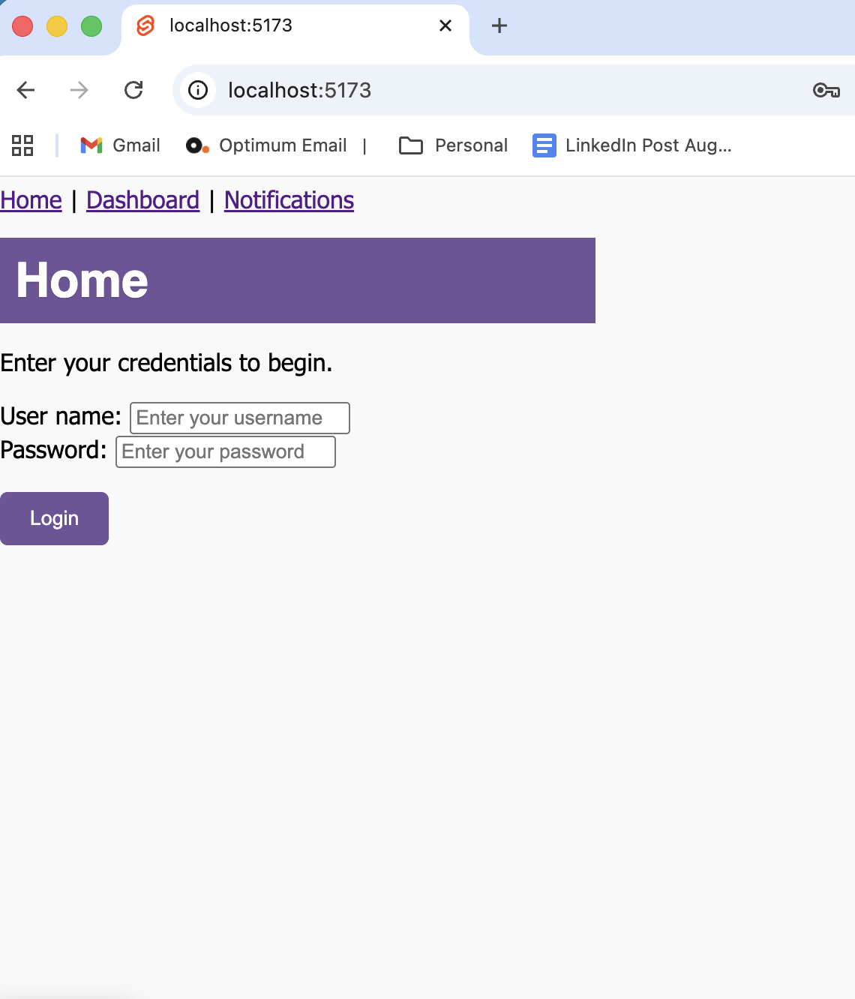
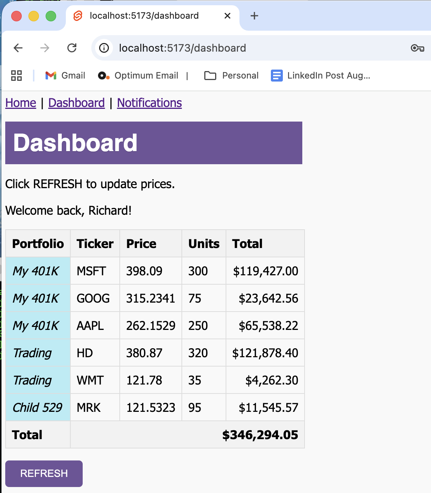

# MarketWatcher Web Application

The MarketWatcher Web Application is a web app demo application for monitoring real-time stock prices.

The application is written using HTML, CSS and JavaScript and importantly, leverages the Svelte Kit Web Application Framework. It illustrates some basic
features of Svelte, a simple, efficient alternative to React.JS, but mainly rounds out the MarketWatcher application suite, which also includes an Android mobile app and a gRPC server written in Go. The application is only a demo, meant primarily as a learning tool.


## Pre-Requisites

To properly run the app, you will need to set up the backend software: the [MarketWatcher Server](https://github.com/rfield/MarketWatcherServer). The server application is also meant as a demonstration and is for learning purposes only.

Additionally, you will need to install:

- node
- npm
- Svelte Kit

## How to Run

```bash
npm run dev -- --open 
```

## Screenshots




